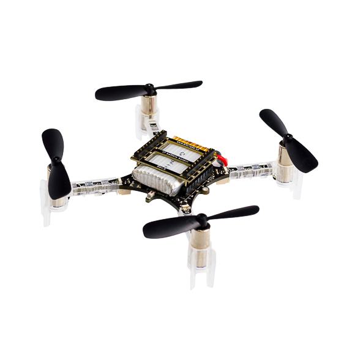
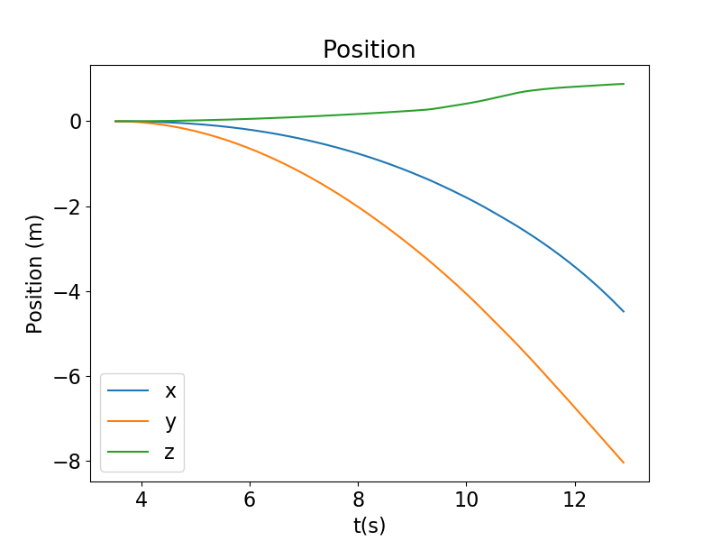
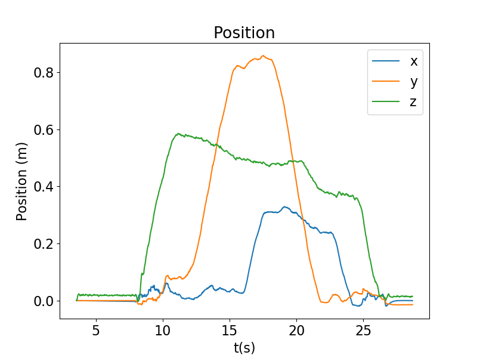
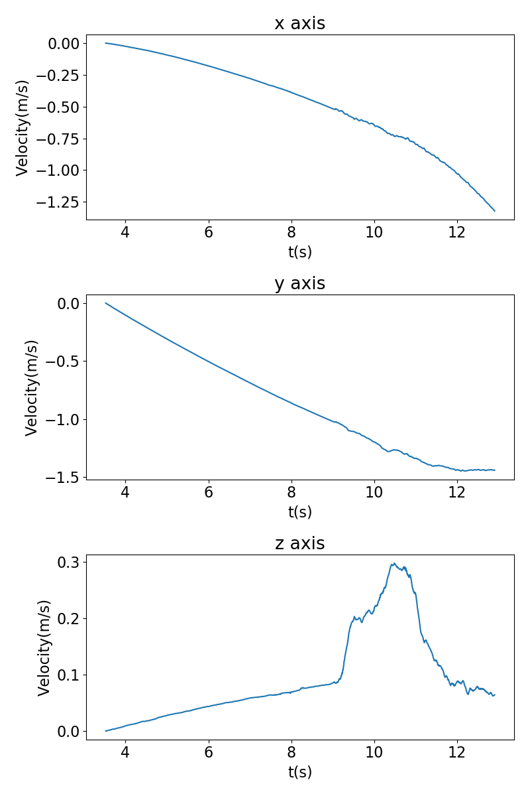
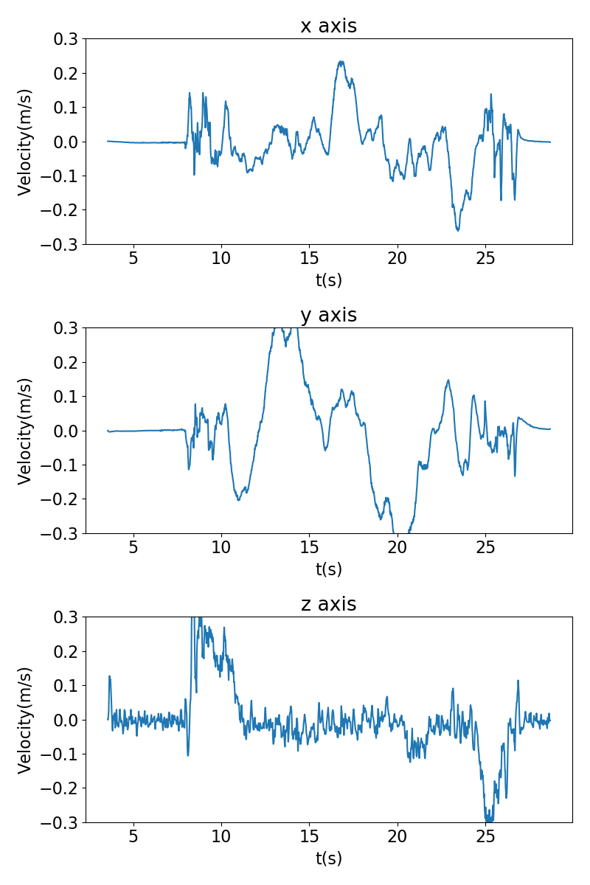

# Error-state Kalman Filter for IMU, optical flow and time-of-flight fusion for Arduino and ESP32 MCU

## Problem
Goal is to obtain **accurate, drift-less** estimations of 3D position, velocity and rotation of an autonomous drone, similarly designed as the CrayzFlie drone in the following image:

<p align='center'>

</p>

Drone contains **IMU, optical flow (OF) and time-of-flight (ToF)** sensors. Due to the nature of IMU noise and bias, trajectories drift without fusion with complementary sensors.

Solution should be real-time and usable on time-constrained Arduino and ESP32 MCUs

## Requirements
- c++17 compiler
- Eigen (header-only library included in [external/](external/) for ease of compilation)

## Method
In order to reduce the drift, OF and ToF measuements are fused with the **Error-state Kalman Filter**. This is a variation of EKF, which propagates **nominal states** and **error-states**, which are then updated when OF and ToF measurements arrive. Error-state formulation decreases linearization errors in Jacobian calculation, and allows seamless representation of rotation propagation and update as **errors in the $so(3)$ tangent space**. Filter implementation is based on the following papares, where you can read more:
- [Covariance Correction Step for Kalman Filtering with an Attitude](http://arc.aiaa.org/doi/abs/10.2514/1.G000848)
- [Quaternion kinematics for the error-state Kalman filter](https://arxiv.org/pdf/1711.02508)

ESKF is implemented in [ESKF.cpp](src/ESKF.cpp). Simple [estimator](include/estimator.hpp) reads IMU, OF and ToF measurements from CSV data for testing. To use the repository as a library, simply change [CMakeLists](CMakeLists.txt) to compile a shared or a static library.

## Measurements
- Measurements of simple testing trajectories are provided in [serial_data.csv](measurements/serial_data.csv).

## Compilation
Compile with: 
``` bash
mkdir build && cd build
cmake ..
make -j8
```

## Execution
Simply provide paths to csv file containing measurements and output file for storing results, e.g.:
``` bash
./estimator measurements/serial_data.csv results.txt
```

This will create a **results.txt** file with positions, velocities and rotations (as quaternions) at each timestamp.

## Results
Filter completely eliminates drift due to IMU noise and bias. Left -- **IMU dead reckoning**. Right -- **ESKF**. 

Estimated positions:
<p align='center'>


</p>
Estimated velocities:
<p align='center'>


</p>

## Arduino and ESP32 compatibility
Repository is compatible with Arduino and ESP32-based MCUs. Only requirement is the Eigen library, which can be easily deployed as in:
- [ESP32 Eigen](https://components.espressif.com/components/espressif/eigen)
- [Arduino Eigen](https://www.arduino.cc/reference/en/libraries/eigen/)

## TODO
- Adding cross-correlation elements to process noise
- Adding rotation variance to process noise
- Adding bias error-states


